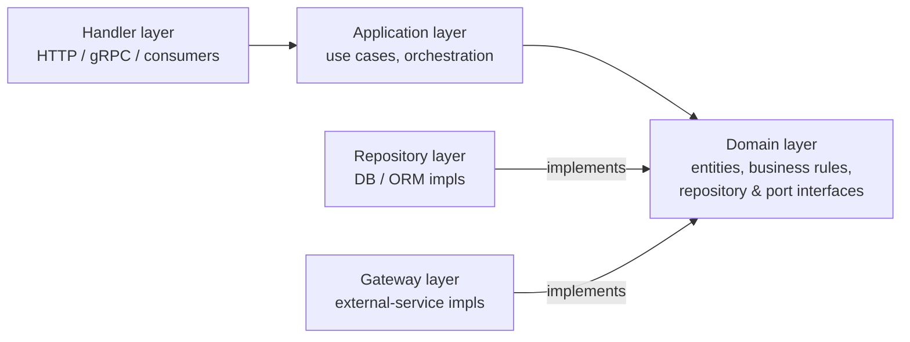
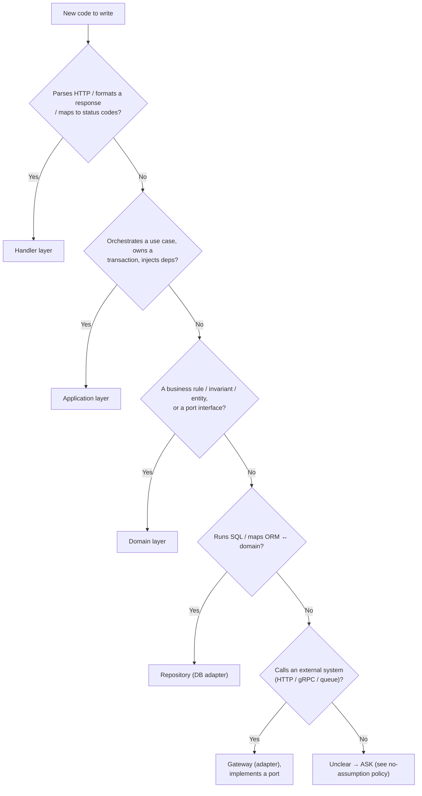

Load and apply the 4-layer architecture below when writing or structuring Go backend code. Respect the inward dependency rule (handler → application → domain ← repository) and put every piece of code in the correct layer.

# 4-Layer Backend Architecture

How to structure Go backend code. Four layers with a strict dependency direction.
Read this together with the Go backend coding standards (`openspec-go-skills`) —
this doc covers *where code goes*; that doc covers *how to write it*.

> "Application layer" and "service layer" mean the same thing here — the go-skills
> doc calls it the service layer; this doc calls it the application layer.

---

## 0. The dependency rule (most important)

Dependencies point **inward**. Outer layers know about inner layers; inner layers
never import outer ones.

```
handler  ──▶  application  ──▶  domain  ◀──  repository (DB adapter)
(HTTP)        (use cases)       (core)   ◀──  gateway    (external-service adapter)
```



- **Domain** is the center. It depends on **nothing** (no framework, no DB, no HTTP).
- **Application** depends on domain (types + repository/port *interfaces*), never on
  handler and never on a concrete repository/gateway implementation.
- **Repository & gateway** depend on domain (to implement its interfaces) — the
  interface is **declared in domain**, implemented in the adapter (Go convention:
  interface lives with the consumer). Repository = adapter for the DB; gateway =
  adapter for external services (see §5).
- **Handler** depends on application; it never talks to repository, gateway, or DB directly.

Quick test: if you can't compile the domain package without importing `net/http`,
`database/sql`, or ORM models, a dependency is pointing the wrong way.

---

## 1. Handler layer (transport / delivery)

**Responsibility**: translate between the outside world and use cases. HTTP
routing, request decoding, auth extraction, response/status mapping. One handler
type per transport concern.

**MUST**
- Parse and validate the *shape* of input (required fields, types, formats) — see §8.
- Call exactly one application use case per request; pass a request-scoped `ctx`.
- Map domain/application errors to transport codes (see §6) and format the response.

**MUST NOT**
- Contain business rules ("an order can ship only if paid" belongs in domain/application).
- Touch the database, ORM models, or repository types.
- Leak transport types (`*http.Request`, gin/echo context) into deeper layers.

```go
// internal/handler/http/order.go
func (h *OrderHandler) ListActive(c *gin.Context) {
    var req ListActiveOrdersRequest
    if err := c.ShouldBindQuery(&req); err != nil {
        respondError(c, http.StatusBadRequest, err) // shape validation only
        return
    }
    result, err := h.app.ListActiveOrders(c.Request.Context(), req.toInput())
    if err != nil {
        respondError(c, mapErr(err), err) // domain/app error -> HTTP status
        return
    }
    c.JSON(http.StatusOK, toListActiveOrdersResponse(result))
}
```

Endpoints of different audiences (admin, authenticated, m2m) are **separate
handlers**. Do not widen an admin handler to serve m2m — see the scope-creep rule
in the Go coding standards.

---

## 2. Application layer (use cases / services)

**Responsibility**: orchestrate a single use case. Coordinate domain objects,
repositories, and gateways; own the transaction boundary (§7); enforce
application-level policy (authorization, feature flags, sequencing — §8). This is
the "service" layer.

**MUST**
- Expose one method per use case with its own input/output struct
  (`ListActiveOrders(ctx, ListActiveOrdersInput) (ListActiveOrdersOutput, error)`).
- Depend on **domain interfaces** (repository & port), injected via the constructor.
- Own transactions and cross-repository consistency; call domain logic for rules.
- Return domain errors (or application errors) — never transport codes.

**MUST NOT**
- Import handler or transport packages.
- Embed data-access details (SQL, eager-load mods) — that is the repository's job.
- Become a God service: split by use case, one filter/input struct per use case
  (see God-function decomposition in the Go coding standards).

```go
// internal/application/order/list_active.go
type Service struct {
    orders domain.OrderRepository // interface, injected
    tx     domain.TxManager
}

func (s *Service) ListActiveOrders(
    ctx context.Context, in ListActiveOrdersInput,
) (ListActiveOrdersOutput, error) {
    orders, err := s.orders.ListActive(ctx, in.toFilter())
    if err != nil {
        return ListActiveOrdersOutput{}, err
    }
    // application policy / domain rules go here, not in the handler or repo
    return newListActiveOrdersOutput(orders), nil
}
```

---

## 3. Domain layer (the core)

**Responsibility**: the business itself — entities, value objects, invariants,
domain services, and the **interfaces** (repository + external-service ports) the
application depends on.

**MUST**
- Be pure Go: no `net/http`, no `database/sql`, no ORM imports.
- Put invariants on the entity (e.g. `func (o Order) IsActive(at time.Time) bool`),
  so rules can't be bypassed.
- Declare repository and port **interfaces** here (the consumer owns the interface):
  ```go
  // internal/domain/order/repository.go
  type OrderRepository interface {
      ListActive(ctx context.Context, f ListActiveFilter) ([]Order, error)
      GetByID(ctx context.Context, id string) (Order, error)
  }
  ```
- Define domain sentinel errors here (`var ErrOrderNotFound = errors.New(...)`).

**MUST NOT**
- Import application, handler, repository, or gateway packages (it must compile alone).
- Know how data is stored or transported.

Keep domain types independent of ORM models — the repository maps ORM → domain.

---

## 4. Repository layer (data access)

**Responsibility**: implement domain repository interfaces against a real store
(e.g. Postgres via an ORM or query builder). Queries, eager loading, ORM ↔ domain
mapping. It is the **DB adapter** — a special case of the port/adapter pattern in §5.

**MUST**
- Implement the interface declared in **domain**; return **domain** types, not ORM models.
- Keep all SQL/ORM concerns here; extract shared logic (eager-load mods, mapping)
  into helpers (see DRY in the Go coding standards).
- Follow the query-performance and security rules from the Go coding standards
  (no full-table-scan subqueries; escape `LIKE`; FK columns are not auto-indexed).
- Map storage errors to domain errors (`sql.ErrNoRows` → `ErrOrderNotFound`).

**MUST NOT**
- Contain business decisions — it retrieves/persists, it does not decide policy.
- Leak ORM models (`models.Order`) upward; convert to `domain.Order`.

```go
// internal/repository/order/list_active.go
func (r *Repository) ListActive(
    ctx context.Context, f domain.ListActiveFilter,
) ([]domain.Order, error) {
    rows, err := models.Orders(activeAtQueryMod(f), orderEagerLoadMods()...).All(ctx, r.db)
    if err != nil {
        return nil, fmt.Errorf("listing active orders: %w", err)
    }
    return toOrderModels(rows), nil // ORM -> domain
}
```

---

## 5. External services (ports & adapters)

The repository is one **port + adapter**: a `domain`-declared interface (the port)
plus a concrete implementation (the adapter) that talks to the DB. **Every other
outbound dependency uses the same shape** — payment providers, email/SMS, other
services, object storage, message brokers. This is what the go-skills doc calls the
"gateway" layer.

- **Port**: an interface expressed in *your* terms (no provider names). Declared in
  `domain` if it's a core business concept, or `application` if it's pure plumbing.
  The consumer owns the interface (Go convention).
- **Adapter**: implements the port, lives in `internal/gateway/<provider>/`, and is
  the *only* place that knows the provider. It maps domain ↔ provider **both ways**,
  and maps provider failures onto **domain sentinel errors**.
- **Dependency rule**: identical to repository — port points inward, adapter points
  outward, the application depends on the port only. Wire the adapter at the
  composition root.

**When to use a port**: any call that leaves your process to a system you don't own
(HTTP/gRPC to another service, payment/email/SMS provider, object storage, queue
publish). **When NOT**: pure in-process logic; and the DB already has its own port
(the repository) — don't double-wrap. Wrap stdlib (time, rand) behind a port only
when you must fake it in tests (e.g. a `Clock`).

```go
// PORT — internal/domain/order/payment.go (your terms, no "Stripe")
type PaymentGateway interface {
    Charge(ctx context.Context, req ChargeRequest) (ChargeResult, error)
}
var (
    ErrPaymentDeclined           = errors.New("payment declined")
    ErrPaymentGatewayUnavailable = errors.New("payment gateway unavailable")
)

// ADAPTER — internal/gateway/stripe/payment.go
var _ domain.PaymentGateway = (*Gateway)(nil) // compile-time: adapter satisfies port

func (g *Gateway) Charge(ctx context.Context, req domain.ChargeRequest) (domain.ChargeResult, error) {
    resp, err := g.client.Do(g.buildRequest(ctx, req)) // provider-specific detail lives HERE
    if err != nil {
        return domain.ChargeResult{}, fmt.Errorf("calling stripe: %w", domain.ErrPaymentGatewayUnavailable)
    }
    defer resp.Body.Close()
    switch resp.StatusCode {
    case http.StatusOK:
        return g.decodeResult(resp) // provider response -> domain type
    case http.StatusPaymentRequired:
        return domain.ChargeResult{}, domain.ErrPaymentDeclined // provider error -> domain error
    default:
        return domain.ChargeResult{}, fmt.Errorf("stripe status %d: %w", resp.StatusCode, domain.ErrPaymentGatewayUnavailable)
    }
}

// APPLICATION depends on the PORT, injected — never on *stripe.Gateway.
type Service struct {
    orders   domain.OrderRepository
    payments domain.PaymentGateway
}
```

Swapping provider (Stripe → Adyen) = a new adapter package + one line at the
composition root; application and domain don't change. Test the application by
injecting a stub that satisfies the port — no HTTP, no provider.

---

## 6. Crossing layer boundaries

**Each boundary has its own types — do not pass one layer's struct through another.**

| Boundary | Input type | Output type |
|----------|-----------|-------------|
| client → handler | request DTO (JSON/query) | response DTO |
| handler → application | use-case input struct | use-case output struct |
| application → repository | domain filter struct | domain entities |
| application → gateway | domain request struct | domain result / domain error |
| adapter → provider/DB | ORM models / provider payloads | mapped to domain before returning |

- **Mapping is explicit**: `req.toInput()`, `toResponse(out)`, `toOrderModels(rows)`.
  No layer imports another layer's DTOs.
- **Errors travel inward-defined, outward-mapped**: domain defines sentinel errors;
  adapters (repository/gateway) map storage/provider failures onto them; application
  returns them; the handler maps them to HTTP status via one `mapErr`. Wrap with
  context using `fmt.Errorf("...: %w", err)`.
- **Wiring/DI** happens at the composition root (`main.go` / a `wire`/`fx` module):
  construct repository & gateway adapters → inject into application → inject into
  handler. Inner layers receive interfaces, never construct their own dependencies.

---

## 7. Transaction boundaries

The **application layer owns transactions** — not the handler, not the repository.
A use case that writes through more than one repository must be atomic.

- Provide a `TxManager` (unit-of-work) that runs a function inside a transaction;
  repositories called within see the same transaction.
- Domain has **no** knowledge of transactions. Handlers never start one.
- Keep the transaction short and do **no external I/O** (gateway calls) inside it —
  call the gateway before/after, not while holding a DB transaction.

```go
// application: place an order + reserve stock atomically
func (s *Service) PlaceOrder(ctx context.Context, in PlaceOrderInput) (PlaceOrderOutput, error) {
    order, err := domain.NewOrder(in.CustomerID, in.Items) // invariants (§8)
    if err != nil {
        return PlaceOrderOutput{}, err
    }
    err = s.tx.WithinTx(ctx, func(ctx context.Context) error {
        if err := s.orders.Save(ctx, order); err != nil {  // same tx (bound to ctx)
            return err
        }
        return s.inventory.Reserve(ctx, order.Items())     // same tx
    })
    if err != nil {
        return PlaceOrderOutput{}, err // WithinTx rolled back on any error
    }
    return newPlaceOrderOutput(order), nil
}
```

Two common shapes: (a) the tx is bound to `ctx` and repositories read it from there
(shown above); (b) `WithinTx` hands you tx-scoped repository handles. Pick one and
use it consistently.

---

## 8. Validation layering

Each kind of validation lives in exactly one layer:

| Layer | Validates | Examples |
|-------|-----------|----------|
| **Handler** | *shape / format* of the request | required fields, types, ranges, enum membership, well-formed email/UUID → reject **400** before calling the use case |
| **Application** | *authorization & policy* | is the caller allowed? feature flag on? quota left? state precondition needing other data |
| **Domain** | *invariants & business rules* | "order total ≥ 0", "can't ship an unpaid order" — enforced on entity construction/mutation so they can't be bypassed |

Rule of thumb: needs only the request payload → **handler**; needs the caller's
identity/permissions or feature state → **application**; an always-true property of
the entity → **domain** (enforce it in the constructor/method and return a domain error).

Don't re-validate the same thing in two layers, and never rely on the handler for an
invariant the domain must guarantee — other callers (jobs, m2m, another use case)
bypass the handler.

---

## 9. Where does this code go? (decision guide)



Suggested package layout:
```
internal/
  handler/<transport>/     # http handlers + request/response DTOs
  application/<domain>/     # use-case services + input/output structs
  domain/<domain>/          # entities, invariants, repository & port interfaces, errors
  repository/<domain>/       # adapter: DB (ORM↔domain mapping)
  gateway/<provider>/        # adapter: external services (payment, email, other APIs)
```

---

## 10. Testing per layer

- **Domain**: pure unit tests on invariants/entities — no mocks, no DB.
- **Application**: unit tests with **mocked repository/port interfaces** — inject a
  stub that satisfies the port (no real DB/provider). Regenerate mocks after changing
  an interface (see the Go coding standards).
- **Repository / gateway (adapters)**: integration/contract tests against the real
  dependency (or a sandbox/mock server). For repositories use `testdata/` fixtures and
  cover happy path, empty, filter exclusion, active-only, relation loading, pagination,
  deterministic ordering.
- **Handler**: table-driven tests for shape validation + error→status mapping, with the
  application use case mocked.

---

## 11. Review checklist

- [ ] Does any layer import an outer layer? (domain must compile alone)
- [ ] Business rules in domain/application — not in handler or repository?
- [ ] Repository returns **domain** types, never ORM models?
- [ ] Repository/port interface declared in **domain**, implemented in the adapter?
- [ ] External calls behind a **port**, adapter in `gateway/`, named in *your* terms
      (not the provider's), provider errors mapped to domain errors?
- [ ] Multi-repository writes wrapped in one transaction (application owns it; no
      external I/O inside the tx)?
- [ ] Validation in the right layer (shape → handler, policy → application, invariant → domain)?
- [ ] Handler does shape-validation only, and maps errors to status via one place?
- [ ] Each use case has its own input/output struct (no God service/filter)?
- [ ] Explicit mapping at every boundary (no DTO leaking across layers)?
- [ ] Dependencies injected at the composition root (constructors take interfaces)?

