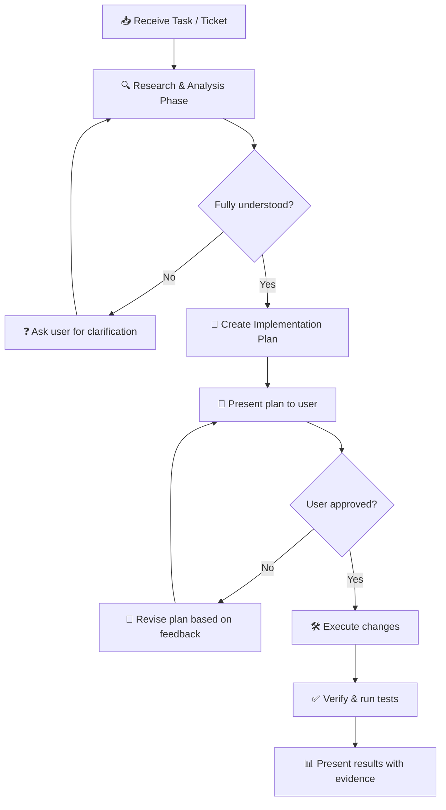
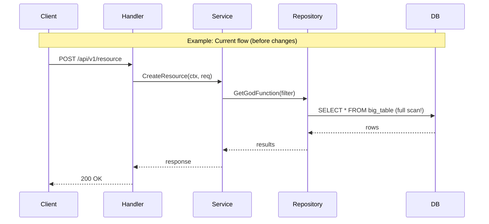
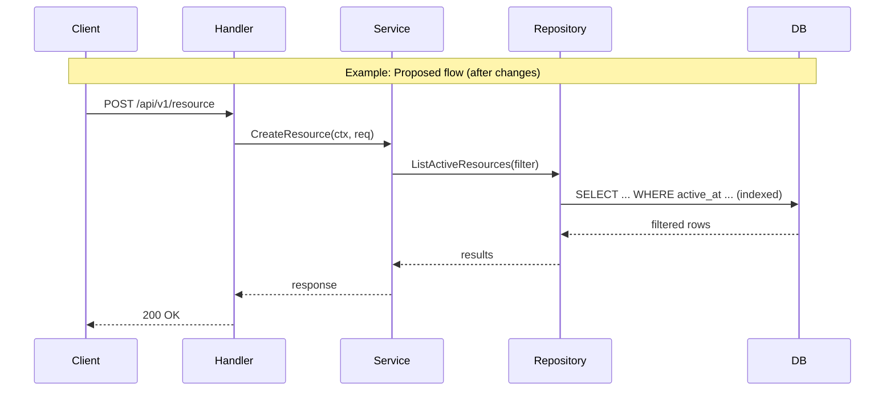
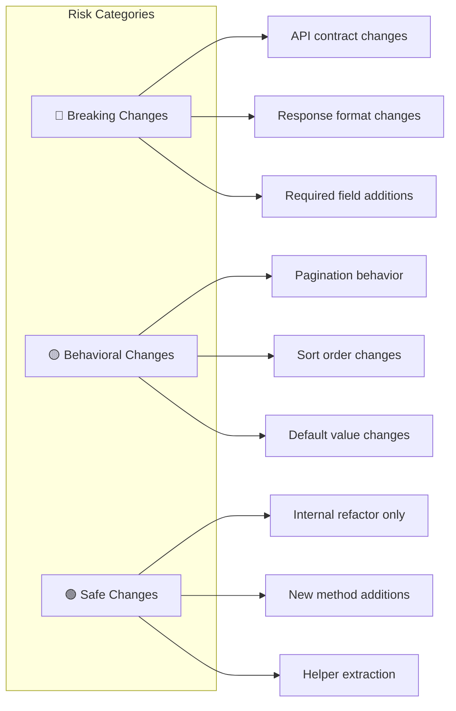
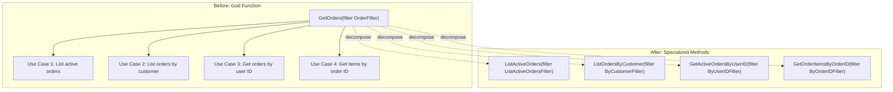
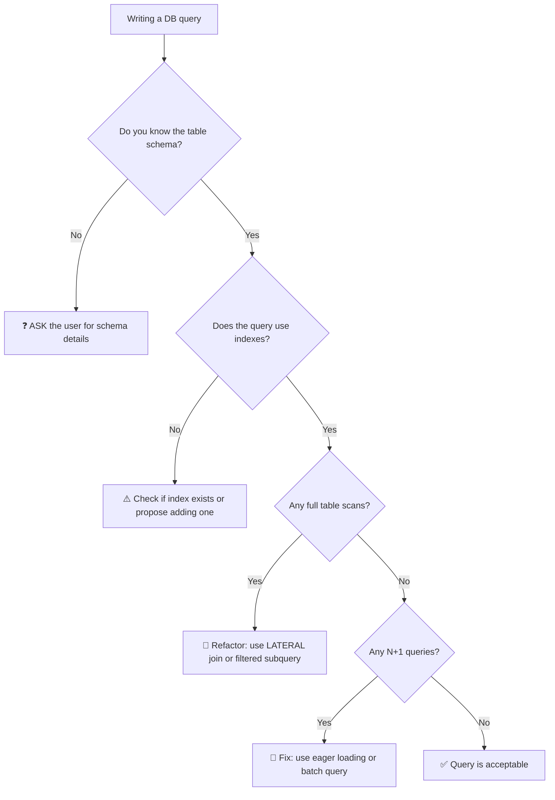
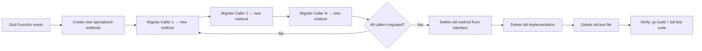
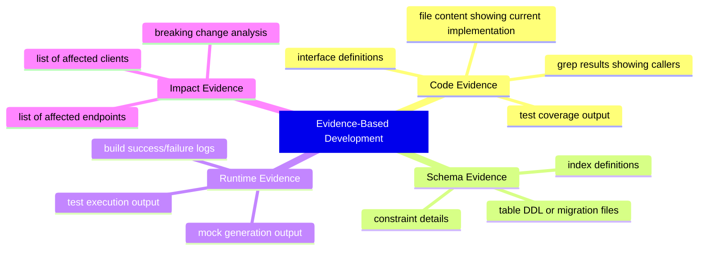
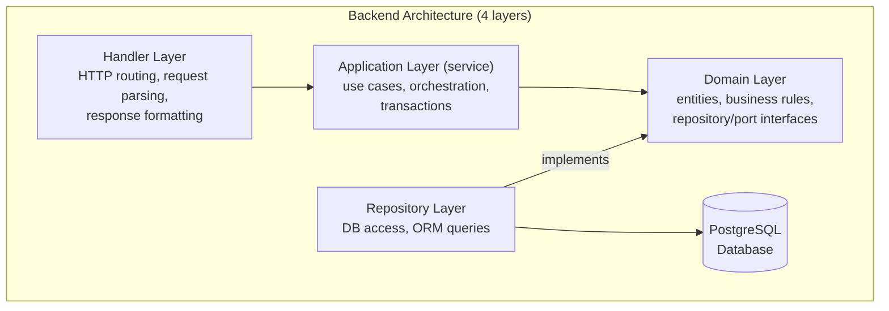

Load and apply the Go coding standards below to the current Go backend task. Treat every rule as binding — in particular the No-Assumption Policy (section 0) and Mandatory Planning Before Execution (section 0.5): research first, present a plan for approval before changing code, and ask instead of assuming whenever anything is unclear.

# Go Backend Coding Standards

Rules and expectations for writing Go backend code. Read together with the
4-layer architecture guide (`openspec-architecture`) — this doc covers *how to
write code*; that doc covers *where it goes*.

---

## 0. No-Assumption Policy

> **MANDATORY RULE**: When unclear or uncertain, you **MUST ask the user immediately**. NEVER assume on your own.

### Situations where you MUST ask:
- **Business logic**: Unclear meaning of a field, flow, or business rule → ASK.
- **Database schema**: Unknown column type, constraint, index, or row count → ASK. Do NOT assume a table is small or large.
- **Naming**: Not sure if a method/struct/file name fits the project convention → ASK, and propose 2–3 options.
- **Scope of change**: Unclear which file or layer (handler/service/repo) should be modified → ASK.
- **Breaking changes**: If the change could affect other callers → LIST all callers and ASK before making changes.
- **Scope creep**: If the ticket only asks for changes in one endpoint/layer (e.g., admin), do NOT modify other endpoints/layers (authenticated, m2m) unless: (1) the change is in a shared/common package and unavoidable, or (2) you have asked and the user confirmed expanding the scope. You MUST list all affected endpoints/callers and **notify the user** before proceeding. Additionally, you MUST **identify potential failure cases** caused by breaking changes, especially:
  - Clients sending requests missing fields (optional fields with Go zero-value defaults that differ from expected validation).
  - Clients sending requests with the old format that is no longer compatible (e.g., adding required fields, changing types, changing enum values).
  - User input edge cases: changed default values, changed pagination/sort behavior, changed response format.
  - Other clients (m2m, internal services) calling the API with the old contract.
- **Test data**: Not sure if existing test data in `testdata/` is sufficient or appropriate → ASK.
- **Config/Environment**: Unclear config values, feature flags, or env variables → ASK.
- **Third-party dependencies**: Unclear version, behavior, or API contract → ASK.

### How to ask correctly:
- Ask **specifically**, with context: "Method `X` is currently called by `Y` and `Z`. Should I split it into 2 methods or keep it as is?"
- Provide **options** when possible: "I see 2 approaches: (A) use LATERAL join, (B) use subquery. Which do you prefer?"
- **NEVER** say "I assume that…" and proceed.

---

## 0.5. Mandatory Planning Before Execution

> **CRITICAL RULE**: Before making ANY code change, you MUST create a plan and get user approval. No code modification is allowed without an approved plan.

### Planning Workflow



### What the Plan MUST Include

#### 1. Flow Explanation (Newcomer-Friendly)

Every plan must explain the current flow and proposed flow clearly enough that **a developer who just joined the team can understand**. Use mermaid diagrams as the primary visualization tool.

**Current Flow Diagram** — Show how the code works TODAY:



**Proposed Flow Diagram** — Show how it will work AFTER changes:



#### 2. Exact Change Locations

For every file to be modified, the plan must specify:

| # | File | Layer | Action | What Changes |
|---|------|-------|--------|-------------|
| 1 | `internal/repository/order/get_orders.go` | Repository | MODIFY | Rename method, add new filter struct |
| 2 | `internal/repository/order/order_helpers.go` | Repository | NEW | Extract shared eager-loading logic |
| 3 | `internal/service/order/service.go` | Service | MODIFY | Update caller to use new method name |
| 4 | `internal/repository/order/interface.go` | Repository | MODIFY | Update interface with new method signature |

#### 3. Impact Analysis with Evidence

Every claim in the plan must be backed by evidence. Use `grep` results, file references, or code snippets.

**Example format:**

> **Claim**: Method `GetOrders` is called by 3 callers.
>
> **Evidence** (grep result):
> ```
> internal/service/order/admin_service.go:45:  repo.GetOrders(filter)
> internal/service/order/auth_service.go:78:   repo.GetOrders(filter)
> internal/handler/admin/order.go:123:          svc.GetOrders(ctx, req)
> ```
>
> **Conclusion**: All 3 callers need to be migrated. Since the ticket scope is admin-only, I will only modify `admin_service.go` now. The other callers (`auth_service.go`, `order.go`) should be addressed in a follow-up ticket.

#### 4. Risk Assessment



For each risk, document:
- **What could break**: Specific scenario
- **Who is affected**: web, mobile, m2m, internal services
- **Mitigation**: How to prevent or handle the breakage

#### 5. Step-by-Step Execution Order

Number each step in the order they will be executed. Include verification checkpoints:

```
Step 1: Create helper file → Verify: go build passes
Step 2: Add new method with filter struct → Verify: go build passes
Step 3: Write tests for new method → Verify: tests pass
Step 4: Migrate caller in admin_service.go → Verify: tests pass
Step 5: Update interface → Verify: go build passes
Step 6: Regenerate mocks → Verify: mock contains new method
Step 7: Run full test suite → Verify: all tests pass
```

### Plan Template

When creating a plan, use this structure:

```markdown
# Plan: [Brief Description]

## Context
- Ticket/Task: [reference]
- Scope: [which layer/endpoint]

## Current Flow
[Mermaid sequence diagram of current behavior]

## Problem Statement
[What is wrong with the current flow — with evidence]

## Proposed Flow
[Mermaid sequence diagram of proposed behavior]

## Change Inventory
[Table of all files to be modified/created/deleted]

## Impact Analysis
[Grep evidence of all callers, breaking change analysis]

## Risk Assessment
[What could break, who is affected, mitigation]

## Execution Steps
[Numbered steps with verification checkpoints]

## Open Questions
[Anything unclear that needs user input]
```

---

## 1. Decompose God Functions (Entire Codebase)

- Applies to **all layers** (handler, service, repository, gateway…), not just the repository.
- **DO NOT** use a single method/function that does too many things, or a single large filter struct serving multiple different purposes.
- **MUST** split into multiple specialized methods, each serving a specific use case.
- Each new method should have its **own filter/input struct** appropriate for that use case.
- **IMPORTANT**: If you discover a God Function during your work, **report it to the user first** for confirmation before refactoring. Do not refactor on your own.
- Example (repo layer): `GetOrders(filter OrderFilter)` → split into `ListActiveOrders(...)`, `ListOrdersByCustomer(...)`, `GetActiveOrdersByUserID(...)`, `GetOrderItemsByOrderID(...)`.



---

## 2. Repository Layer Design

### DRY — Extract Shared Logic
- When multiple methods share common logic (eager loading, ORM → model conversion), **extract** it into helper functions.
- Place helpers in a separate file, e.g., `order_helpers.go`.
- Example helpers: `orderEagerLoadMods()`, `toOrderModels()`, `activeAtQueryMod()`.

### Naming Conventions
- Method names should be **concise and descriptive**. Avoid overly long names.
- **List vs Get**: Method returning a **slice** → prefix with `List` (e.g., `ListActiveOrders`). Method returning a **single record** → prefix with `Get` (e.g., `GetOrderByID`). **DO NOT** use `Get` for methods that return a slice.
- Filter structs follow the pattern: `<MethodName>Filter`.
- Files are named after the main method in the file, e.g., `list_active_orders.go`, `get_order_by_id.go`.

### Pointer Usage
- **Avoid pointers** when not necessary. Prefer value types for small/medium structs.
- Use pointers only when: (1) you need to mutate the receiver, (2) the struct is very large, (3) you need to represent `nil` (optional value).
- If you **must use a pointer**, you **MUST explain to the user** why a pointer is needed instead of a value type.

### Security
- When using `LIKE`/`ILIKE` in SQL, you **must escape** special characters (`%`, `_`, `\`) to prevent wildcard injection.
- Always use parameterized queries (provided by your ORM or the `database/sql` driver — never string-concatenate user input into SQL).

### Database Query Performance
- When generating code involving DB statements (query, join, subquery…), **MUST consider performance**.
- **Avoid subqueries that materialize entire tables** in JOINs (e.g., `SELECT DISTINCT ON (...) * FROM big_table` then joining). Prefer using `LATERAL` joins or filtering subqueries with specific conditions.
- **Note**: PostgreSQL **does NOT automatically create indexes** on foreign key columns. Only primary keys have automatic indexes. Do NOT assume an index exists just because there is an FK reference.
- If you **don't know the table schema** (columns, indexes, constraints, row count), **MUST ask the user** before proposing a query solution.
- When reviewing/modifying queries, check: Is there a full table scan? Is the subquery necessary? Can existing indexes be used?



---

## 3. Testing Standards

### Always Run Tests After Every Change
- After modifying code, you **MUST run tests** to verify before reporting results.
- Load any required test environment variables first (from the project's test env file, if it has one).
- Example command: `go test ./internal/repository/order/... -run "TestXxx" -v -count=1`.

### Required Test Cases
- **Happy path**: Correct result with valid input.
- **Empty result**: The entity does not exist.
- **Filter exclusion**: Filter does not match (e.g., `ActiveAt` outside the range).
- **Inactive exclusion**: Only return ACTIVE records, exclude INACTIVE.
- **Relation loading verification**: Verify that related entities are loaded correctly.
- **Pagination**: `ShowTotalCount=true/false`, page size, page number.
- **Combined filters**: Multiple filters applied simultaneously.
- **Case-insensitive search**: If search text is involved.
- **Sort order**: Ensure deterministic ordering to avoid flaky tests.

### Flaky Test Prevention
- If a query has **no ORDER BY**, add `sort.Slice` in the test to sort results before asserting.
- When comparing entities with loaded relations, ignore the relation fields in the comparison (e.g., via an `ignoreFields` list) so unrelated relation data doesn't make the assertion brittle.

### Test Data
- Keep test fixtures (e.g., SQL files) in the `testdata/` folder.
- When adding new test cases, check if existing test data is sufficient; if not, add to the fixture files.

---

## 4. Mock Generation

- After changing an interface, you **MUST regenerate mocks** using the project's tooling (e.g., `go generate ./...`, `mockery`, or a `make` target).
- If the generation requires tools that aren't available (e.g., Docker), notify the user so they can run it manually.
- Verify the mock by grepping to confirm the new method exists in the generated mock file.

---

## 5. Code Review Checklist

When reviewing code, check the following:

### Correctness
- [ ] Are there any callers still using the old method? (grep the entire codebase)
- [ ] Has the interface been updated?
- [ ] Have mocks been regenerated?
- [ ] Is test coverage sufficient? (per the test case list above)
- [ ] Are there any SQL injection risks?
- [ ] Is error handling complete? (no ignored errors, wrap with context)

### Clean Code
- [ ] Are names concise, consistent, and self-explanatory?
- [ ] Is there any code duplication that can be extracted into a helper?
- [ ] Is the function too long? (>50 lines → needs splitting)
- [ ] Are there too many parameters? (>4 → use input struct)
- [ ] Is there deeply nested if/else? (>3 levels → use early return)
- [ ] Are there magic numbers/strings? (→ use named constants)
- [ ] Is there dead code or commented-out code? (→ delete)
- [ ] Are there boolean params that obscure meaning? (→ use option struct)

### Performance
- [ ] Does the query cause a full table scan? Can existing indexes be used?
- [ ] Are there N+1 queries?
- [ ] Can independent DB calls be run in parallel (errgroup)?

---

## 6. Clean Code Standards

### Function/Method Design
- **Single Responsibility**: Each function does one thing only. If you need a comment explaining "this part does X, that part does Y" → split it.
- **Length limit**: Functions should not exceed ~50 lines. If longer, extract helpers.
- **Parameter limit**: Maximum 3–4 params. If more, group into an input struct.
- **Early return**: Use guard clauses to return early, avoiding deeply nested if/else.
- **Avoid boolean params**: Boolean params obscure meaning at the call site. Prefer enums/consts or option structs.

### Naming
- **Variables**: Names must be self-explanatory. Avoid `u`, `r`, `o` — use `user`, `row`, `order`.
- **Abbreviations**: Only use common abbreviations: `ctx`, `err`, `req`, `resp`, `cfg`, `svc`, `repo`. Do not invent custom abbreviations.
- **Boolean vars/methods**: Use prefix `is`, `has`, `can`, `should`. Example: `isActive`, `hasItems`, `canReserve`.
- **Consistent naming**: The same concept must use the same name throughout the codebase. Don't alternate between `location`, `loc`, and `place`.

### Error Handling
- **Wrap errors** with context: `fmt.Errorf("retrieving user %s: %w", userID, err)` (use your project's stack-wrapping helper if it has one).
- **Do not ignore errors**: Every error must be handled or returned. No `_ = someFunc()`.
- **Sentinel errors**: Use `var ErrXxx = errors.New(...)` for domain errors, placed in the `errors.go` file of the package.
- **Do not log then return error**: Choose one — log or return — to avoid duplicate logs.

### Comments
- **Exported functions/types** MUST have doc comments in Go format: `// FunctionName does...`.
- **Do not comment obvious code**: `// increment i` before `i++` is redundant.
- **TODO comments**: Format `// TODO(owner): description`. Must have an owner and clear description.
- **Explain WHY, not WHAT**: Comments should explain the reasoning, not restate the code.

### Code Organization
- **Imports**: Split into 3 groups: stdlib → external libs → internal packages. Each group separated by a blank line.
- **File size**: Each file should not exceed ~300 lines. If longer, split by responsibility.
- **Constants**: Group related constants using `const ()` blocks. Place at the top of the file or in a separate file.
- **Interface placement**: Interfaces are placed in the consumer's package, not the provider's (Go convention).

### Avoid Code Smells
- **No magic numbers**: Use named constants instead of literal numbers. `timeout := 30 * time.Second` → `timeout := defaultRequestTimeout`.
- **No deep nesting**: Maximum 3 levels. If deeper, extract functions or use early return.
- **No copy-paste**: If you see the same code block ≥ 2 times, extract it into a helper.
- **No unused code**: Delete dead code, commented-out code, unused imports/variables.

### Context Propagation
- **`ctx context.Context` is the FIRST parameter** of any function that does I/O or can block. Thread it down through every layer; never store a `ctx` in a struct field.
- **Respect cancellation/deadlines**: pass `ctx` into every DB/HTTP/gateway call so it aborts when the caller gives up; in long loops, check `ctx.Err()` and bail out early.
- **Set timeouts at the boundary** for outbound calls (`ctx, cancel := context.WithTimeout(ctx, ...)`), and **always `defer cancel()`**.
- **Don't inject `context.Background()`/`context.TODO()` in a request path** — thread the real request `ctx`. Use `context.Background()` only at the composition root or in background jobs.
- **Carry only cross-cutting metadata in `ctx`** (trace/request id, auth principal) via typed keys — never business parameters.

### Logging & Observability
- **Use structured logging** (key/value fields), not `fmt.Printf`. One logger, injected or taken from `ctx`.
- **Log at boundaries and on errors** — not inside tight loops or once per row.
- **Never log PII or secrets** (tokens, passwords, full card numbers, personal data). Redact before logging.
- **Correlate logs** by threading a request/trace id through `ctx` into the logger, so one request's logs can be found together.
- **Log an error once**, at the layer that decides not to propagate it — the flip side of "do not log then return".
- **Pick the right level**: `error` = needs attention; `warn` = degraded but handled; `info` = key state transitions; `debug` = dev detail. Prefer metrics/traces over per-call logs on hot paths.

### Configuration
- **Load and validate ALL config at startup** and fail fast with a clear message — not lazily on first use.
- **No scattered `os.Getenv`.** Parse env/flags/file **once** into a typed `Config` struct at the composition root, then inject the specific values each component needs (a URL, a timeout) — not the whole `Config`, not the environment.
- **Required values are explicit** (error if missing); provide sane defaults for the rest.
- **Never hardcode secrets** — read them from env or a secret manager, and keep them out of logs (see above).

---

## 7. Migration Strategy (Deprecating Old Methods)

- When decomposing a God Function, **migrate callers one by one**.
- After all callers have been migrated, **delete the old method** from the interface and implementation.
- Also delete the old method's test file.
- Verify with `go build` and the full test suite.



---

## 8. Environment & Tooling

- **Don't hardcode environment assumptions.** Local setup (database, migrations, containers, env vars, mock/codegen commands) is project-specific — read it from the project's README or config, and if it isn't documented, ASK.
- Prefer the project's documented commands (make targets, scripts, `go generate`) over ad-hoc ones.
- When a step needs infrastructure that may not be running (DB, message broker, Docker), state the prerequisite explicitly instead of assuming it's available.

---

## 9. Evidence-Based Development

> **RULE**: Every decision, claim, or change must be backed by concrete evidence. "I think" or "I believe" is not acceptable.

### Types of Evidence Required



### Evidence Collection Workflow

| Step | Action | Evidence Required |
|------|--------|-------------------|
| 1 | Identify affected code | `grep` results for method/function usage across all layers |
| 2 | Understand current behavior | Read and quote the relevant source code |
| 3 | Check schema | Show table DDL, indexes, constraints (or ASK if unknown) |
| 4 | Assess impact | List all callers with file:line references |
| 5 | After implementation | Show `go build` success, test pass output |
| 6 | After mock regeneration | `grep` for new method in mock file |

### Anti-Patterns (DO NOT)

- ❌ "This method is probably only called in one place" — **GREP to verify**.
- ❌ "The table likely has an index on this column" — **CHECK the schema or ASK**.
- ❌ "This change shouldn't break anything" — **LIST all callers and VERIFY**.
- ❌ "Tests should pass" — **RUN them and SHOW the output**.

---

## 10. Newcomer-Friendly Communication

> **RULE**: Explain everything as if the reader has just joined the team and has no prior context about the codebase.

### Explanation Standards

1. **Always start with the big picture**: Before diving into code details, explain the business context and why this code exists.

2. **Use architecture diagrams** to show how components relate:



(This mirrors the 4-layer model in the `openspec-architecture` guide.)

3. **Annotate code changes** with inline comments explaining the WHY:

```go
// Before: God function handling 4 different use cases
// func (r *repo) GetOrders(filter OrderFilter) ([]Order, error)
//
// Problem: Different callers need different subsets of data,
// but all go through the same filter struct, leading to:
// - Unclear which fields are relevant for which use case
// - Performance issues (loading unnecessary relations)
// - Difficult to test (too many combinations)
//
// After: Specialized method for listing active orders only
func (r *repo) ListActiveOrders(filter ListActiveOrdersFilter) ([]Order, error) {
    // ...
}
```

4. **Use tables to compare** before vs. after:

| Aspect | Before | After |
|--------|--------|-------|
| Method | `GetOrders(filter)` | `ListActiveOrders(filter)` |
| Filter fields | 15+ fields, most unused | Only relevant fields for this use case |
| Relations loaded | All relations always | Only required relations |
| Test complexity | High (many combinations) | Low (focused test cases) |

5. **Provide a glossary** for domain-specific terms when relevant:
   - **M2M**: Machine-to-machine — API calls between internal services (no user context).
   - **Eager loading**: Loading related database records in the same query to avoid N+1 queries.
   - **Sentinel error**: A predefined error value (`var ErrX = errors.New(...)`) callers compare against with `errors.Is`.

